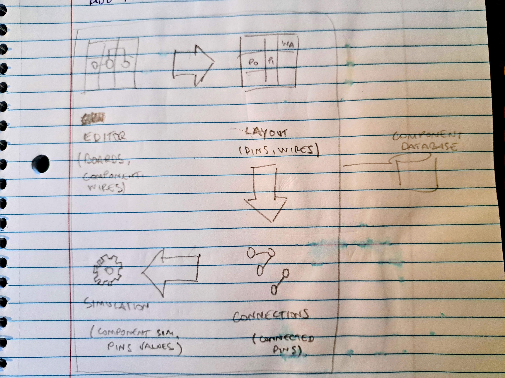

# Transistor Project Engine

The `Sandbox` is the class the contains the build/simulation engine. It contains:

* the `Editor`, used for editing a circuit (holds `Components` and `Wires`)
* a `ComponentDatabase`, which holds components types that can be added to the editor.

Every time a change is made to the editor, a compilation process kicks in that will:

* compile the `Editor` into a `Layout`, which contains the exact position of the component `Pins` and `Wires`. Each
  layout tile is divided in 5 (four sides + center).
* compile the `Layout` into `Connections`, in which each connection contains the group of connected pins and wires.

The `Simulation` is then run on the `Connections`, which execute the component code and calculate the pins values and,
from that, the connection value. The value is then fed back to the `Editor`, which is used to give visual feedback to
the user.

